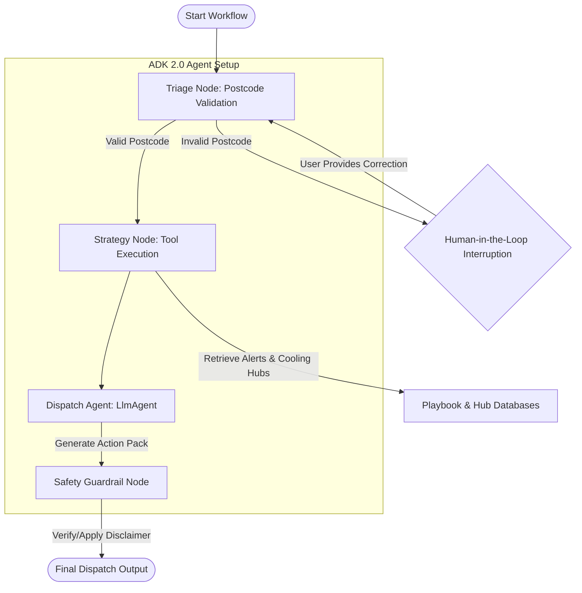

# ☀️ Community Heatwave Dispatch Agent

A premium, clinically-guided multi-agent workflow portal built using the **Google ADK (Agent Development Kit) 2.0** and **Streamlit**. This application coordinates volunteer dispatch, verifies regional UKHSA alert levels, matches clinical safety guidelines for vulnerable residents, and includes human-in-the-loop validation for postcode inputs.

---

## 📊 Workflow Diagram & Agent Flow

The following Mermaid diagram visualizes the multi-agent workflow graph and human-in-the-loop interruption mechanism:



For a detailed deep-dive into the codebase structure and individual node logic, see [project.md](file:///Users/ShahimaIA2/Documents/Capstone Project_5 day AI agents/community-heatwave-agent/project.md).

---

## 🚀 Quick Start Guide

### Prerequisites
1. **uv**: Fast Python package manager ([Install uv](https://docs.astral.sh/uv/getting-started/installation/)).
2. **Google Cloud SDK** (if using Vertex AI integration) or a **Gemini Developer API Key**.

### Setup Environment
Configure your local environment variables in a `.env` file:
```bash
GEMINI_API_KEY="your-api-key"
```

### Installation
Run the following setup commands:
```bash
# Setup agents-cli and install dependencies
uvx google-agents-cli setup
agents-cli install
```

### Running the App
Start the interactive Streamlit dispatcher interface:
```bash
uv run streamlit run app/ui.py
```
Or use the CLI playground:
```bash
agents-cli playground
```

---

## 🛠️ CLI Reference & Commands

| Command | Description |
|---------|-------------|
| `agents-cli install` | Installs project dependencies using `uv` |
| `agents-cli playground` | Launches the local playground |
| `agents-cli lint` | Runs ruff and typestate linting checks |
| `agents-cli deploy` | Deploys the ADK agent to Agent Runtime |
| `agents-cli publish gemini-enterprise` | Registers your agent with Gemini Enterprise |
