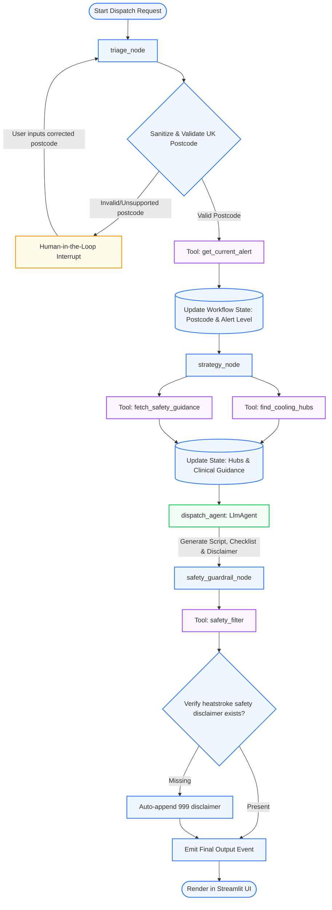

# ☀️ Community Heatwave Dispatch Project

## 📋 Project Description
The **Community Heatwave Dispatch** system is a clinically-guided, multi-agent public health coordination portal built using the **Google ADK (Agent Development Kit) 2.0** and **Streamlit**. It is designed to assist community dispatchers and street-level volunteers in West Yorkshire (covering pilot zones like Leeds and Bradford) during UKHSA Heat-Health Alerts.

The system triages UK postcodes, retrieves real-time weather/health alert guidelines, maps localized cooling hub resources (e.g., air-conditioned libraries and community hubs), and synthesizes tailored door-knocking checklists and scripts based on resident vulnerability profiles (elderly, infants, chronic illness). It also incorporates a **Human-in-the-Loop (HITL)** validation loop to allow dispatchers to correct erroneous postcodes interactively before agent execution.

---

## 📊 Process & Workflow Diagram

---

## 📂 Codebase Explanation

This project follows the official Google ADK 2.0 structure. Below is an explanation of the core files:

### 1. `app/agent.py`
The orchestrator of the entire multi-agent workflow.
*   **Data Models**: Defines `HeatwaveWorkflowInput` (input arguments) and `DispatchOutput` (structured JSON schema generated by the LLM).
*   **triage_node**: Checks if the entered postcode belongs to the supported list (`LS1`, `BD1`, `WF1`, `HD1`, `HX1`). If not, it uses ADK's `RequestInput` to trigger an interrupt, pausing the workflow to wait for user interaction.
*   **strategy_node**: Calls tools asynchronously to gather regional resources (cooling hubs) and clinical instructions for the target group.
*   **dispatch_agent**: A `LlmAgent` using the `Gemini` model (`gemini-flash-latest`). It constructs the final action pack using context collected from previous nodes.
*   **safety_guardrail_node**: A validation node that passes the generated script to the safety filter to ensure clinical safety.
*   **root_agent**: A `Workflow` graph topology linking the nodes sequentially.

### 2. `app/tools.py`
Contains local helper python tools and mock database accessors:
*   `sanitize_and_validate_postcode`: Validates UK postcode formats to prevent injection attacks.
*   `get_current_alert`: Parses UKHSA warning rules from `app/data/playbook.json`.
*   `find_cooling_hubs`: Resolves address, hours, and facility tags of libraries/centers from `app/data/hubs.json`.
*   `fetch_safety_guidance`: Matches clinical risks and actions for different groups.
*   `safety_filter`: Verifies that a vital emergency disclaimer is appended to the script.

### 3. `app/ui.py`
The UI layer powered by Streamlit:
*   Imports the ADK `InMemoryRunner` to run the agent session statefully.
*   Uses premium custom HSL colors and glassmorphism styling to deliver a modern public health portal.
*   Interacts with the ADK workflow, listening for `RequestInput` events to display a Human-in-the-Loop text input form when a validation error occurs, allowing seamless execution resume.
